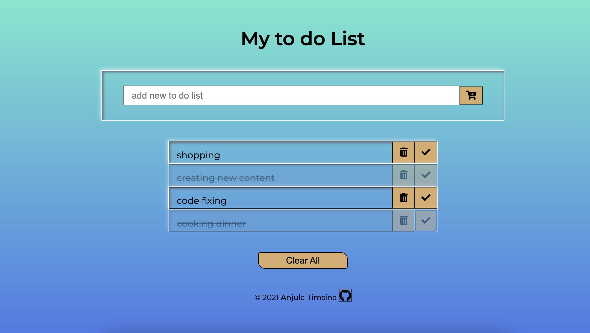

# TODO App Typescript Version

This is the to do app created using HTML CSS and typescript with DOM manupulation.

- start by npm init in project folder
- npm install typescript
- create tsconfig file(tsc --init)

## tsconfig.js

- add watch true in tsconfig.js
- you can exclude your ts file by including "exclude":["node_modules","test.ts"] in config file.
- lib includes libraries you need 'DOM', 'ES6','DOM:iterable' ...
- sourceMap: true; for debugging in vscode (downlaod chrome browser ext)

After configurating tsconfig file

- open tsc watch in terminal(tsc --w)

## Functionality

## addList()

when user input data in the input field and clicks add button. IT triggers the addList() function which generates newlist item.

```shell
  <li class="newlist"><p>${input.value}</P>
    <button type="button" class="trash-btn">
	  <i class="fa fa-trash"></i>
	</button>
    <button type="button" class="complete-btn">
	  <i class="fa fa-check"></i>
	</button>
  </li>
```

## DeleteCompleteEventHandler

For each newlist, button's classname is checked. If the matched classname is "trash-btn" then it triggers the delete event and delete all things that is inside parent element. gitElse if it is "complete-btn" it triggers the checked event which toggle the class completed.

## Screenshot


